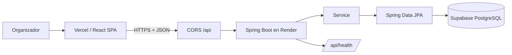

# Conexión: cómo fluye frontend → backend → Supabase

## Componentes y URLs reales (verificadas 2026-09-24)

| Componente | Despliegue | URL |
| --- | --- | --- |
| Frontend (SPA Vite) | Vercel | `https://planificador-eventos-frontend-ten.vercel.app` |
| Backend (Spring Boot) | Render | `https://planificador-eventos-backend-1.onrender.com` |
| Base de datos | Supabase | pooler `aws-0-us-west-2.pooler.supabase.com:6543` (usuario `postgres.akyvplcsiqhmfkqxvgoq`) |

## Flujo



1. El SPA (Vercel) llama al backend por HTTPS con JSON.
2. El backend (Render) valida CORS contra el origen del frontend.
3. Spring expone `/api/**`; los controllers resuelven con DTOs.
4. JPA/Hibernate persiste en Supabase a través del **pooler transaccional** (IPv4).
5. `/api/health` refleja estado de la app y de la BD.

## CORS

`app.cors.allowed-origins=https://*.vercel.app,http://localhost:5173` en `application.properties`, aplicado por `config/CorsConfig.java` a `/api/**` con `allowCredentials(true)`.

- El frontend desplegado (`*.vercel.app`) funciona.
- El desarrollo local apuntando al backend desplegado también pasa CORS si se abre desde `localhost:5173`.

## El fallback del frontend (`api.js`)

```js
const API_BASE_URL = (
  import.meta.env.VITE_API_URL || 'https://planificador-eventos-backend-1.onrender.com'
).replace(/\/$/, '');
```

- Si `VITE_API_URL` no está (o quedó sin prefijo), se usa la URL fija del `-1`.
- Por eso el despliegue funciona aunque la variable de Vercel no esté: el fallback apunta al backend correcto.

## Dominios que NO son este proyecto (confusos)

| Dominio | Qué es |
| --- | --- |
| `planificador-eventos-backend.onrender.com` (sin sufijo) | Otra API (no Spring): `/api/health` → `{"status":"ok"}`, `/v3/api-docs` → 404. Nunca usar. |
| `planificador-eventos-frontend.vercel.app` (sin `-ten`) | Otro build (Create React App) que llama a `backend.vercel.app/...`. No es este proyecto. |

## Endpoint de estado

`GET /api/health` → `{"status":"healthy","database":"connected","timestamp":"..."}` ; 503 si la BD no responde (con `unhealthy`/`disconnected`).